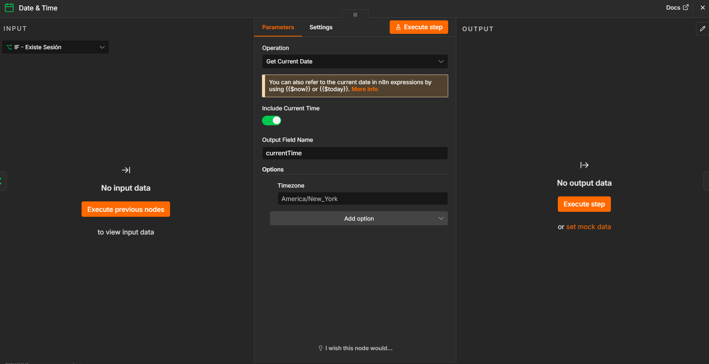
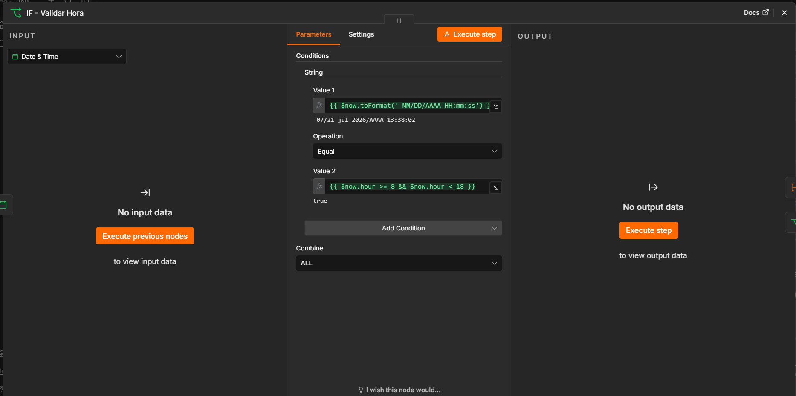
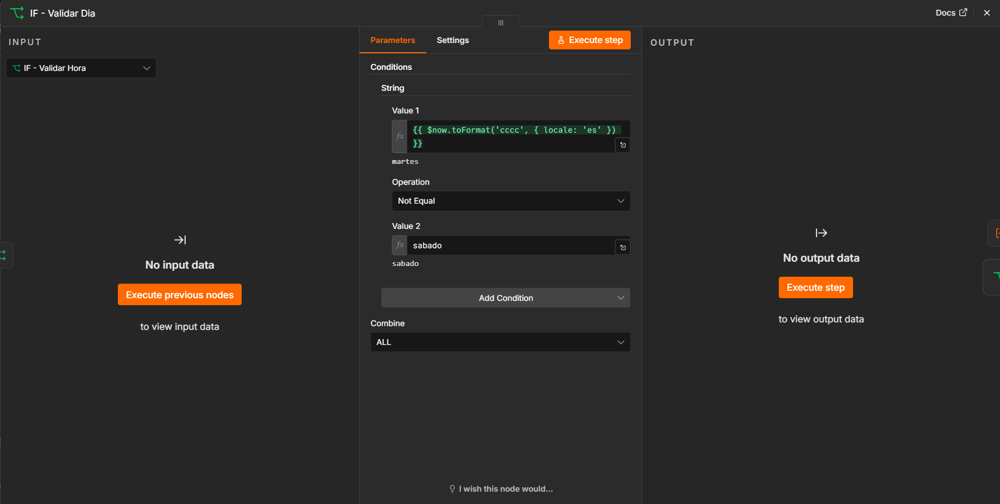
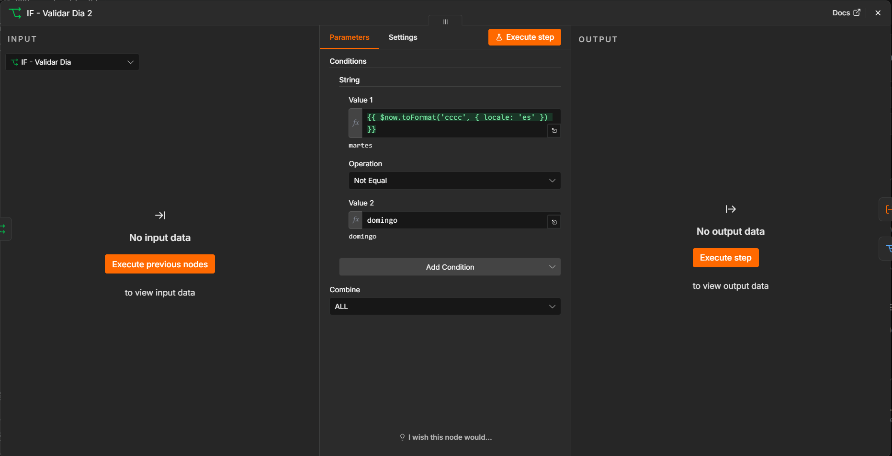
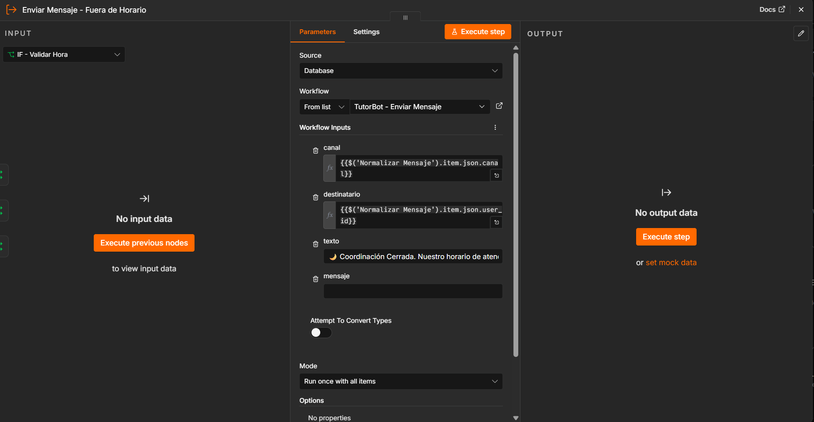
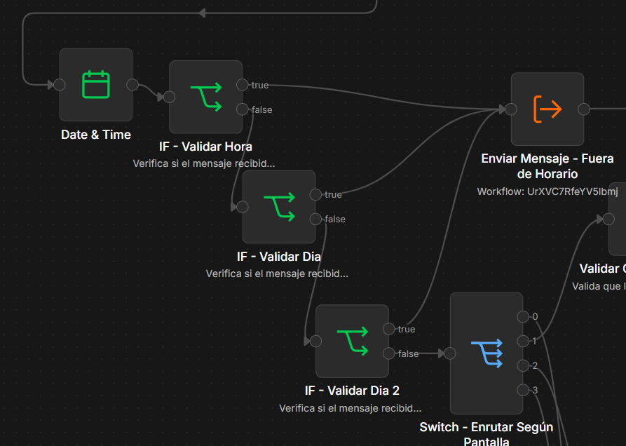

# Evaluacion n8n
## Objetivo
 Control de Horario de Atención de Tutorías (1,5H)

Enfoque: Uso de expresiones de fecha/hora y restricciones de flujo.

Contexto para el estudiante: Los estudiantes están solicitando tutorías fuera del horario de atención de la coordinación (ej. medianoche), lo que genera confusión al momento de asignar tutores.

Objetivo: Bloquear el flujo de solicitud si el usuario intenta agendar fuera del horario de atención.

Requerimientos (60 min)

Configuración de Horario: Definir que el horario de atención es de Lunes a Viernes de 08:00 AM a 06:00 PM.
Nodo de Decisión: Inmediatamente después de que el usuario elija "Solicitar Tutoría", insertar un nodo IF que valide la hora actual ($now).
Mensaje de Cierre: Si está fuera de horario, detener el flujo y enviar: 🌙 Coordinación Cerrada. Nuestro horario de atención es de Lunes a Viernes, 8am a 6pm. ¡Escríbenos mañana!
Excepción: Permitir que se pueda "Consultar estado de tutorías" pero no "Solicitar nueva Tutoría".

## Resultado y Paso a Paso
- Implemente un nodo de date y time para tener la fecha y hora actual.

- Luego hice un if el cual valida si la hora a la que escribe esta entre las 8 AM y 6 PM.

- Posteriormente hice otro if el cual valida si le estan escribiendo un sabado.

- Despues hice lo mismo para el dia domingo

- Por ultimo, hice que todos los if en dado caso incumplen algo que hace que esten por fuera de horario se le redireccionara a un nodo de redireccion con el mensaje que se le va a enviar al sub-workflow y despues al usuario.

## Estructura Final de la modificacion
